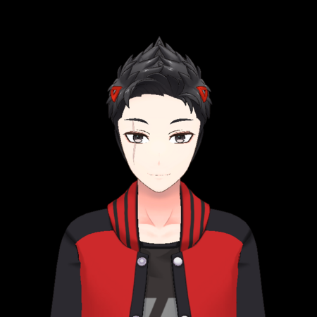

<p align="center">
  
</p>

<h1 align="center">KVT Hub — Global Education & Research Ecosystem</h1>

<p align="center">
  <strong>Ekosistem pendidikan, karir, dan riset digital global.</strong><br>
  Dari TK hingga S3/PhD · 7 Peran · 130+ Halaman · Gamifikasi RPG · Musik Streaming · LED Dot Matrix
</p>

<p align="center">
  
  
  
  
  
  
  
</p>

<p align="center">
  
  
  
  
  
  
  
</p>

<p align="center">
  <a href="docs/TENTANG.md">📖 Tentang</a> •
  <a href="docs/ALUR.md">🏗️ Arsitektur & Alur</a> •
  <a href="CHANGELOG.md">📋 Changelog</a> •
  <a href="CONTRIBUTING.md">🤝 Kontribusi</a> •
  <a href="SPONSOR.md">💎 Sponsor</a> •
  <a href="#-instalasi">⚡ Instalasi</a> •
  <a href="#-kontak">📬 Kontak</a>
</p>

---

## 📸 Preview

<table>
  <tr>
    <td align="center"><strong>🏫 Sekolah</strong><br></td>
    <td align="center"><strong>📚 Kelas</strong><br></td>
    <td align="center"><strong>🔬 Lab</strong><br></td>
  </tr>
  <tr>
    <td align="center"><strong>🏟️ Lapangan</strong><br></td>
    <td align="center"><strong>🛠️ Praktek</strong><br></td>
    <td align="center"><strong>📖 Perpustakaan</strong><br></td>
  </tr>
  <tr>
    <td align="center"><strong>👨‍💼 Admin Panel</strong><br></td>
    <td align="center" colspan="2"><strong>🐱 Kuro — Maskot KVT Hub</strong><br></td>
  </tr>
</table>

---

## ✨ Apa itu KVT Hub?

**KVT Hub v7.0** adalah platform ekosistem digital all-in-one yang menghubungkan **13 jenjang pendidikan** (TK–S3/PhD), **7 peran pengguna**, dan **130+ halaman** dalam satu sistem terintegrasi.

| Fitur | Deskripsi |
|-------|-----------|
| 🎓 **13 Jenjang** | TK, SD, SMP, SMA, SMK (3 jurusan), D1-D3, S1, S2, S3, Post-Doc, Profesi |
| 👥 **7 Peran** | Admin, Staff, Guru, Siswa, Mahasiswa, Orang Tua, Pengunjung |
| 📄 **130+ Halaman** | 82 landing publik + 48 halaman dashboard/panel |
| 🎮 **Gamifikasi RPG** | 100 level, 10 rank, XP system, achievement badges |
| 🎵 **Music Player** | 5 stasiun radio streaming (Lo-Fi, Jazz, Deep House, Ambient, Classical) |
| 💡 **LED Dot Matrix** | Panel LED hijau neon, 5 mode (Shalat, Waktu Dunia, Motivasi, Info, Kustom) |
| 🔍 **Search Engine** | 3 mode pencarian (Internal, Web, AI Explorer) |
| 📊 **30+ Diagram** | Bar, Line, Pie, Doughnut, Radar, Polar via Chart.js v4 |
| 🌍 **Visitor Analytics** | Tracking real-time, geo-lokasi, flag counter |
| 🛡️ **ISO 27001 + COBIT** | Standar keamanan enterprise |

> 📖 **Selengkapnya:** [docs/TENTANG.md](docs/TENTANG.md)

---

## 🆕 Apa yang Baru di v7.0

- 💡 **LED Dot Matrix Panel** — Panel LED hijau neon (#00ff66) dengan 5 mode di top bar
- ⏳ **Loading Screen** — Animasi logo "K", progress bar, auto-hide 1.2 detik
- 📌 **20 Menu Navigasi** — Dari 16 → 20 menu dengan arrow slider
- ☰ **Menu Layanan** — Paket Langganan, Sertifikat, CV Builder, FAQ, Hubungi Kami
- 📰 **4 Section Baru Landing** — Teknologi, Testimoni, Statistik, FAQ
- ⚡ **PHP 8.3 Upgrade** — 8.1.10 → 8.3.25 untuk Laravel 11
- 🚀 **Performa** — Cache config, route, view

> 📋 **Changelog lengkap v1.0 — v7.0:** [CHANGELOG.md](CHANGELOG.md)

---

## 🏗️ Arsitektur

```
┌─────────────────────────────────────────────────┐
│               Browser (Client)                   │
│  Tailwind CSS · Chart.js · Font Awesome · AOS   │
└──────────────────────┬──────────────────────────┘
                       │ HTTP
                       ▼
┌─────────────────────────────────────────────────┐
│              Laravel 11 Router                   │
│  web.php · admin.php · pengajar.php · staff.php │
│  Middleware: auth, peran:{role}, CatatPengunjung │
└──────────────────────┬──────────────────────────┘
                       │
          ┌────────────┼────────────┐
          ▼            ▼            ▼
   ┌────────────┐ ┌─────────┐ ┌─────────┐
   │ Controller │ │  Model  │ │  View   │
   │  28 total  │ │ 25+ ORM │ │ Blade   │
   │            │ │         │ │ 130+    │
   │ Admin (14) │ │ User    │ │ halaman │
   │ Publik (4) │ │ Kelas   │ │         │
   │ Auth   (3) │ │ Krs     │ │ 4 layout│
   │ Role   (7) │ │ Nilai   │ │ sidebar │
   └──────┬─────┘ └────┬────┘ └─────────┘
          │             │
          │        ┌────┴────┐
          └───────>│PostgreSQL│
                   │ 20+ tbl │
                   └─────────┘
```

> 🏗️ **Diagram lengkap (ERD, Use Case, Flowchart, Class Diagram):** [docs/ALUR.md](docs/ALUR.md)

---

## 📊 12 Pilar Ekosistem (20 Menu)

| No | Pilar | Menu | Sub | Deskripsi |
|----|-------|------|-----|-----------|
| 1 | 🎓 Jenjang Pendidikan | Jenjang | 13 | TK hingga Post-Doktoral & Profesi |
| 2 | 🔬 Riset & Inovasi | Riset | 4 | Publikasi, kolaborasi, paten, konferensi |
| 3 | 💼 Karir & Industri | Karir | 4 | Job matching, magang, mentoring, CV builder |
| 4 | 🌐 Komunitas | Komunitas | 5 | Forum, study group, alumni, hackathon |
| 5 | 📜 Sertifikasi | Sertifikasi | 3 | Kompetensi, cloud/tech, blockchain |
| 6 | 📦 Sumber Daya | Sumber Daya | 3 | E-Book, dataset, dev tools |
| 7 | 🛡️ Keamanan | Keamanan | 2 | ISO 27001, privasi data |
| 8 | ✅ Penjamin Mutu | Mutu | — | QA/QC, SPK, PDCA |
| 9 | 📘 Kurikulum | Kurikulum | 4 | Silabus, RPS, kalender, outcomes |
| 10 | 🗺️ Alur & Panduan | Panduan | 4 | Flowchart, SOP, panduan, FAQ |
| 11 | 🎬 Media | Media | 4 | Video, webinar, podcast, galeri |
| 12 | 📄 Dokumen | Dokumen | 4 | Kebijakan, template, formulir, regulasi |

---

## 👥 Multi-Role System

| Peran | Dashboard | Sidebar | Kemampuan Utama |
|-------|-----------|---------|-----------------|
| 👑 Admin | `/admin` | 15 menu | CRUD semua data, laporan, analytics, kunci |
| 👨‍🏫 Pengajar | `/pengajar` | 9 menu | Kelola kelas, materi, kuis, laporan |
| 👨‍💼 Staff | `/staff` | 6 menu | Kelola pengguna, kehadiran, rekap |
| 👨‍🎓 Pengguna | `/pengguna` | 10 menu | Belajar, KRS, KHS, kuis, progress |

---

## 🛠️ Teknologi

| Kategori | Stack |
|----------|-------|
| **Backend** | Laravel 11, PHP 8.3+ |
| **Database** | PostgreSQL 14+ |
| **Frontend** | Tailwind CSS (CDN), Blade Templates |
| **Charting** | Chart.js v4 (30+ jenis diagram) |
| **Animasi** | AOS v2.3.4, CSS Snow, Ticker |
| **Ikon** | Font Awesome 6.5.1 |
| **Font** | Google Fonts (Plus Jakarta Sans, Press Start 2P) |
| **LED** | Dot Matrix Panel (5 mode, hijau neon) |
| **Geo API** | ip-api.com |
| **Keamanan** | RBAC, CSRF, XSS, reCAPTCHA, Auth Guard |
| **Musik** | Streaming radio (ilovemusic.de) |
| **Translate** | Google Translate Widget (6 bahasa) |

---

## ⚡ Instalasi

### Prasyarat

- PHP 8.2+ · Composer · PostgreSQL 14+ · Laragon / XAMPP

### Langkah

```bash
# Clone
git clone https://github.com/kuro-myths/kvt-hub.git
cd kvt-hub

# Install dependencies
composer install

# Environment
cp .env.example .env
php artisan key:generate

# Database (PostgreSQL)
# Buat database: CREATE DATABASE "kvt-hub";
# Sesuaikan .env → DB_CONNECTION=pgsql

# Migrasi & Seed
php artisan migrate --seed

# Storage & Gambar
php artisan storage:link
cp -r gambar/* public/images/

# Jalankan
php artisan serve
# Atau via Laragon → http://kvt-hub.test (rekomendasi)

# Optimize (opsional)
php artisan config:cache
php artisan route:cache
php artisan view:cache
```

### 🔑 Akun Demo

| Peran | Email | Password |
|-------|-------|----------|
| 👑 Admin | admin@kvthub.id | admin123 |
| 👨‍🏫 Guru | guru@kvthub.id | guru123 |
| 👨‍💼 Staff | staff@kvthub.id | staff123 |
| 👨‍🎓 Siswa | siswa@kvthub.id | siswa123 |
| 🎓 Mahasiswa | mahasiswa@kvthub.id | mahasiswa123 |
| 👪 Orang Tua | orangtua@kvthub.id | orangtua123 |
| 👤 Pengunjung | pengunjung@kvthub.id | pengunjung123 |

**Kunci Admin:** `KVT-ADMIN-2025-SECRET`

---

## 📂 Struktur Proyek

```
kvt-hub/
├── app/
│   ├── Http/Controllers/       # 28 controllers
│   │   ├── Admin/              # 14 admin CRUD controllers
│   │   ├── Pengajar/           # Pengajar controllers
│   │   ├── Staff/              # Staff controllers
│   │   └── Pengguna/           # Pengguna controllers
│   ├── Models/                 # 25+ Eloquent models
│   └── Middleware/             # CekPeran, CatatPengunjung
├── database/
│   ├── migrations/             # 20+ migration files
│   └── seeders/                # Split per domain
├── resources/views/
│   ├── tata-letak/             # 4 layout (utama, dasbor, auth, sidebar)
│   ├── akun/                   # Dashboard per role
│   ├── halaman/                # 66+ landing pages
│   └── auth/                   # Login, register, verifikasi
├── routes/
│   ├── web.php                 # Public routes
│   ├── admin.php               # Admin routes (90+ endpoints)
│   ├── pengajar.php / staff.php / pengguna.php
├── gambar/                     # Gambar fasilitas & Kuro
├── docs/                       # Dokumentasi tambahan
│   ├── TENTANG.md              # Detail lengkap KVT Hub
│   ├── ALUR.md                 # ERD, Use Case, Flowchart
│   ├── README-v7-lengkap.md    # README versi detail (backup)
│   └── screenshots/            # Screenshot website
├── CHANGELOG.md                # Riwayat v1.0 — v7.0
├── SPONSOR.md                  # Sponsor & donasi
└── LICENSE                     # MIT License
```

---

## 📄 Dokumentasi Lengkap

| Dokumen | Isi |
|---------|-----|
| 📖 [docs/TENTANG.md](docs/TENTANG.md) | Apa itu KVT Hub, fitur detail, 130 halaman, API endpoints |
| 🏗️ [docs/ALUR.md](docs/ALUR.md) | ERD, Use Case, Flowchart, Class Diagram |
| 📋 [CHANGELOG.md](CHANGELOG.md) | Riwayat perubahan v1.0 → v7.0 |
| 💎 [SPONSOR.md](SPONSOR.md) | Informasi sponsor, tier, cara berkontribusi |
| 🤝 [CONTRIBUTING.md](CONTRIBUTING.md) | Panduan kontribusi, commit convention, auto-commit |
| 📜 [LICENSE](LICENSE) | MIT License + Lisensi Kerja Sama & Sponsor |
| 📚 [docs/README-v7-lengkap.md](docs/README-v7-lengkap.md) | README detail 1300+ baris (backup) |

---

## 💎 Sponsor & Dukungan

<p align="center">
  
</p>

| Tier | Benefit |
|------|---------|
| 🏆 **Platinum** | Logo di README + landing page + semua halaman |
| 🥇 **Gold** | Logo di README + landing page |
| 🥈 **Silver** | Logo di README |
| 🥉 **Bronze** | Nama di daftar pendukung |
| 🌱 **Community** | Mention di changelog |

> 💎 **Detail lengkap:** [SPONSOR.md](SPONSOR.md)

---

## 🤝 Kontribusi

Kami menyambut kontribusi dari siapa saja! Baca panduan lengkapnya:

> 📖 **Panduan lengkap:** [CONTRIBUTING.md](CONTRIBUTING.md)

### Quick Start

1. Fork repository ini
2. Buat branch fitur (`git checkout -b fitur/nama-fitur`)
3. Commit perubahan (`git commit -m 'feat: tambah fitur baru'`)
4. Push ke branch (`git push origin fitur/nama-fitur`)
5. Buat Pull Request

### 🤖 Auto Commit

Gunakan script auto-commit untuk mempercepat workflow:

```bash
# Windows (PowerShell)
.\auto-commit.ps1 "feat: tambah fitur baru"

# Tanpa pesan (otomatis generate timestamp)
.\auto-commit.ps1

# Linux/macOS
./auto-commit.sh "fix: perbaiki bug login"
```

> Lihat [CONTRIBUTING.md](CONTRIBUTING.md) untuk panduan commit convention, branching strategy, dan GitHub Actions auto-commit.

---

## 📬 Kontak

| | |
|---|---|
| 📧 **Email** | kerjasama@kvthub.id |
| 🔒 **Security** | security@kvthub.id |
| 🐱 **GitHub** | [@kuro-myths](https://github.com/kuro-myths) |
| 🌐 **Website** | [kvt-hub.test](http://kvt-hub.test) |

---

<p align="center">
  <br>
  <strong>KVT Hub v7.0</strong> — Global Education & Research Ecosystem<br>
  Dibuat oleh <a href="https://github.com/kuro-myths">@kuro-myths</a><br>
  © 2025–2026 KVT Hub. Semua hak dilindungi.
</p>
